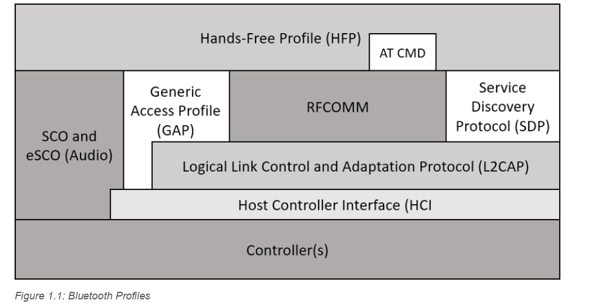
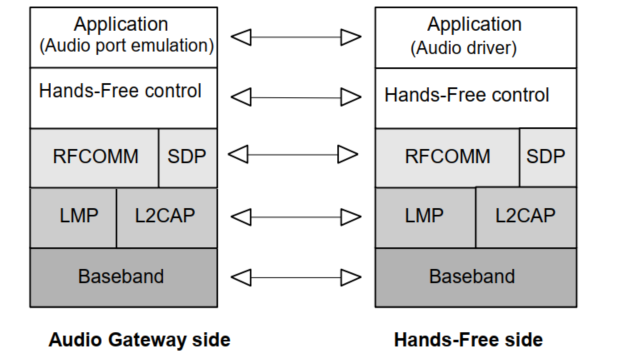
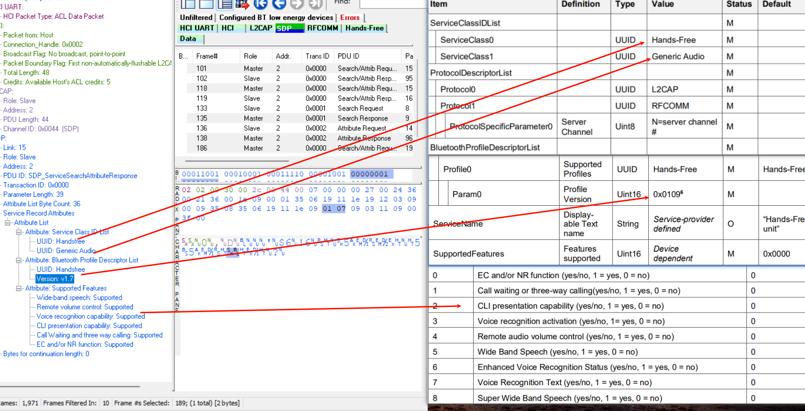
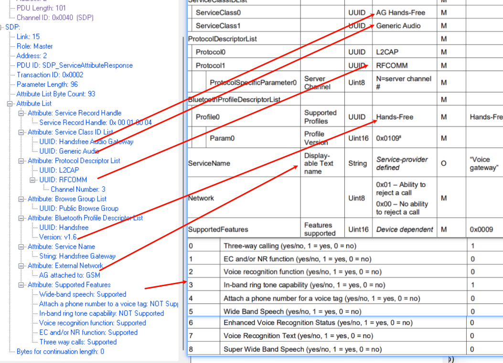

# HFP 

本文基于HFP1.9 pdf，以及一些cfa的讲解

**HFP1.9 -> HFP1.8 更新主要内容**

**LC3-SWBS  超级宽带语音**

**HFP1.8 -> HFP1.7 更新内容**

**EVRA: 增强语音识别激活**

**HFP1.7-> HFP 1.6 HF 指示器**

## 简介

 HFP(Hands-free Profile)，可以让蓝牙设备可以控制电话，如接听、挂断、拒接、语音拨号等，拒接、语音拨号要视蓝牙耳机及电话是否支持。

HFP定义了音频[网关](http://baike.baidu.com/view/807.htm)(Audio Gateway)和免提组件(Hands Free)两个角色：

**AG**–该设备为音频（特别是手机）的输入/输出网关。通常指的是**手机**

**HF**–该设备作为音频[网关](http://baike.baidu.com/view/807.htm)的远程音频输入/输出机制，并可提供若干遥控功能。通常指的是耳机或者其他免提设备。**通常指带有麦克风的耳机或者音箱**

下面是HFP1.9 中的章节，主要内容在章节4和章节5。 

| 章节                               | 大概内容            | 备注                                         |
| ---------------------------------- | ------------------- | -------------------------------------------- |
| 1  Introduce                       | 介绍                | 仔细看完，                                   |
| 2 Porfile overview                 | Profile 大概内容    | 仔细看完，                                   |
| 3 application layer                | AG和HF需要的feature | 仔细看完，重点feature索引都在这里            |
| **4 Hands-Free Control**           | **AT 命令交互**     | **仔细看部分，需要的时候要能快速查到仔细查** |
| **5 AT Command and Results Codes** | **AT cmd和结果**    | **仔细看部分，需要的时候能快速仔细查**       |
| 6 RFCOMM                           | RFCOMM 交互需求     | 仔细看完，                                   |
| 7 GAP                              | GAP中的需要内容     | 仔细看完，                                   |
| 8-9                                | 参考和专业名词      | 不用看                                       |
| 10 mSBC技术                        |                     | 需要处理codec的需要仔细看                    |
| 11 code ID                         |                     | 仔细看完，                                   |
| 12 PLC 的实现                      |                     | 需要PLC的仔细看                              |
| 13 质量指标                        | 音质质量指标        | 略看                                         |
| 14 LC3-SWB 技术                    | LC3-SWB 技术指标    | 略看                                         |

## 框架结构

****

HFP 最核心的就是AT CMD， AT CMD是HFP的主要内容，主要是AT 命令来处理大部分HFP流程。

涉及到AT CMD来传输命令，AT CMD类似于很多网络卡片，例如WIFI 里面的cmd，需要通过串口相互传输，所以AT CMD是架设在RFCOMM之上的

另外大部分的br/edr的profile都是有SDP做服务描述的。类似于的GATT里面的service表格。

HFP还需要使用GAP的一些定时器等相关的服务。

打电话传输的音频数据是用的msbc还是CVSD来传输的，由Hfp来控制。

### AG HF 交互框图

这里有个类似于OSI的网路协议的结构

L1 : baseband  物理层，这层是无线电流

L2: 数据链路层， LMP 和L2CAP层

L3: 网路层， 这一层是广播和发现来实现。

L4: 传输层 RFCOMM 

L5: 会话层  

L6: 表示层： SDP

L7: 应用层： HFP

##  SDP 服务

AG端和HF端都维护一张SDP表， profile中列举了该表的说明，主要这张表中有一个feature需要重点了解一下。

我们来看下这张表中的内容

HF的SDP中会有HF端的HFP的版本信息，如图1.7

下面是HF的feature

- EC/NR 这个是回声消除和降噪
- call waiting or three-way calling  三方通话是否支持
- CLI presentation capability  主叫线路识别
- Voice recognition activitation  VR 语音识别
- remote audio volume control    远程音量控制
- wide band speech    WBS 宽带是否支持（msbc）
- enhanced Voice recognition 状态， 高级语音识别VR是否支持
- Voice recognition text   ： 语音识别文字是否支持
- Super Wide Band Speech    : SWBS 是否支持

下面是AG端的SDP 信息

这边只讲feature信息，其他的部分可以在assigned number中获取

- Three-way calling   三方通话是否支持
- EC/NR    回声消除和降噪是否支持
- Voice recognition   语音识别
- In-band ring tone capability   是否支持带内响铃
- Attach a phone number for voice tag   是否支持电话号码当成一个tag

- WBS  宽带载波是否支持
- Enhance Voice Recoigition  高级语音识别装调
- Voice Recognition Text  语音识别文字
- SWBS   LC3宽带载波是否支持

上面所有描述的feature 都在第三章节中有对应的流程索引

## AT 命令

上面是蓝牙相关的，下面就要讲到AT命令

AT cmd是控制整个HFP的灵魂，都是贯穿大部分的流程，

AT+都是由HF端发起的, 比如AT+BRSF

AG端回应的都是+..     比如+BRSF

AT命令基本沿用了3GPP中定义的AT cmd的部分内容, 同时蓝牙有自己扩充的,

需要看详细内容,就可以看[27007-680_at_cmd.doc](ref\27007-680_at_cmd.doc) 

参考：

[1] Bluetooth Core Specification, Version 4.2 or later  

[2] [27007-680_at_cmd.doc](ref\27007-680_at_cmd.doc) 

[3] [HFP_v1.9.pdf](ref\HFP_v1.9.pdf) 

[4]  [headset 1.1.pdf](ref\headset 1.1.pdf) 

[5]  [Assigned_Numbers.pdf](ref\Assigned_Numbers.pdf) 